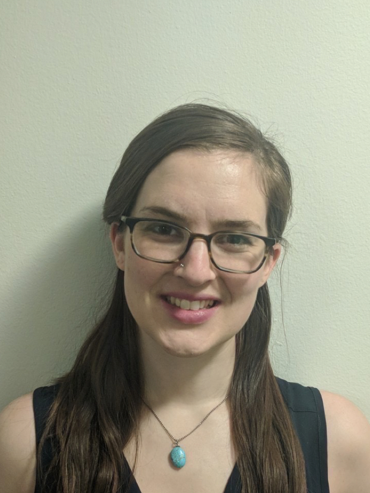

---
---

<link rel="stylesheet" href="styles.css" type="text/css">

## About me 
I am a PhD Candidate at Columbia University, working in the [Developmental Affective Neuroscience Lab](https://danlab7.wixsite.com/mysite/). My graduate research focuses on neurobiological development following early adversity. I have training in pediatric neuroimaging, fMRI task development, and longitudinal statistical modeling in R. My research has been funded by the National Institutes of Mental Health, the National Science Foundation, and the American Psychological Foundation. 

In 2020, I will begin a post-doctoral fellowship at NYU Child & Adolscent Psychiatry Department, working with Dr. Moriah Thomason. 

You can find my full CV [here](files/VanTieghem_CV-11-21-2019.pdf) 

Outside the lab, I can be found riding my bike with the [NYCC Women's Race Team](nyccwomensracing.com) and [blogging](https://www.nyccwomensracing.com/blog/2019/11/24/my-first-concussion) about concussion awareness and prevention.